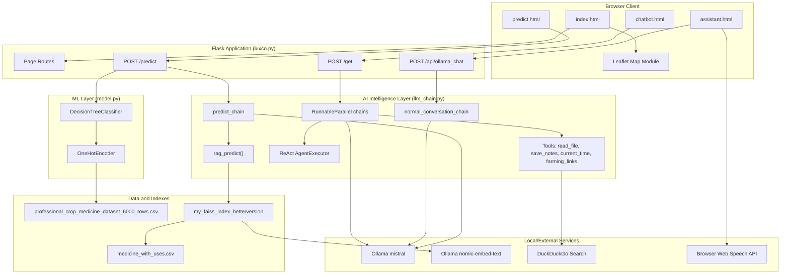
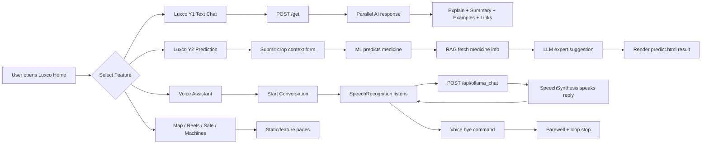
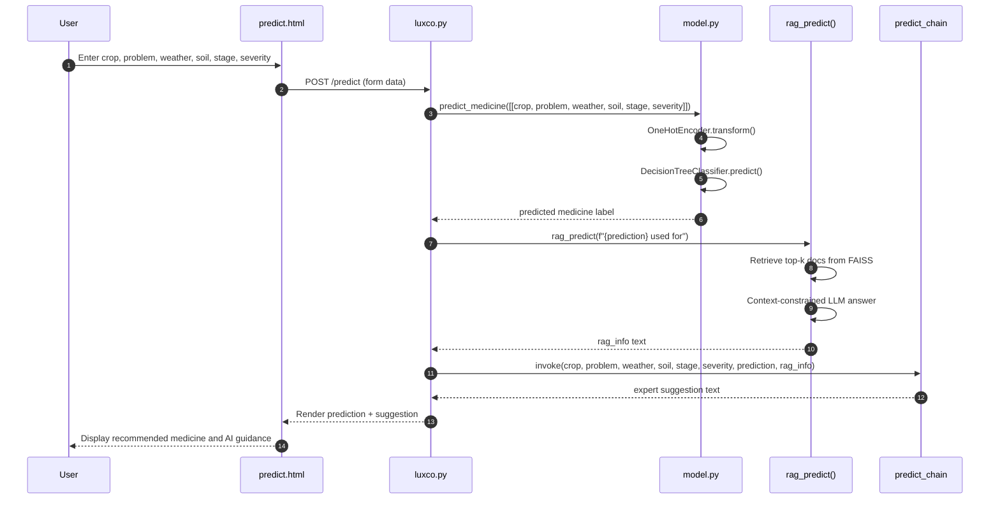
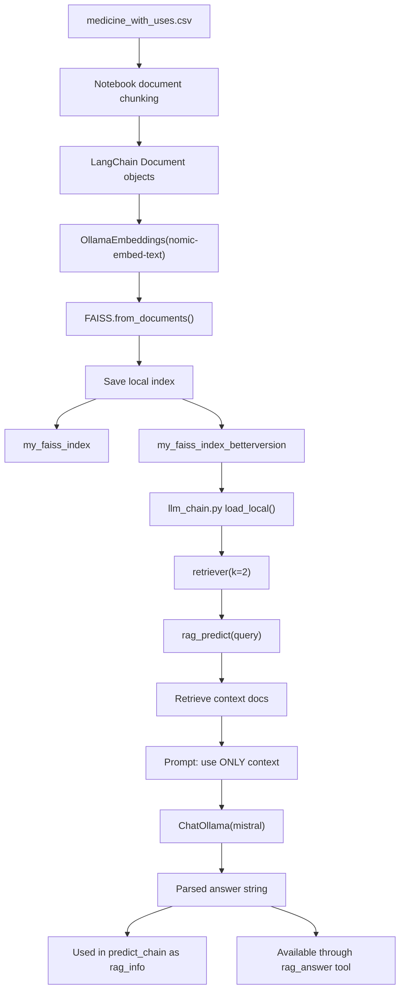
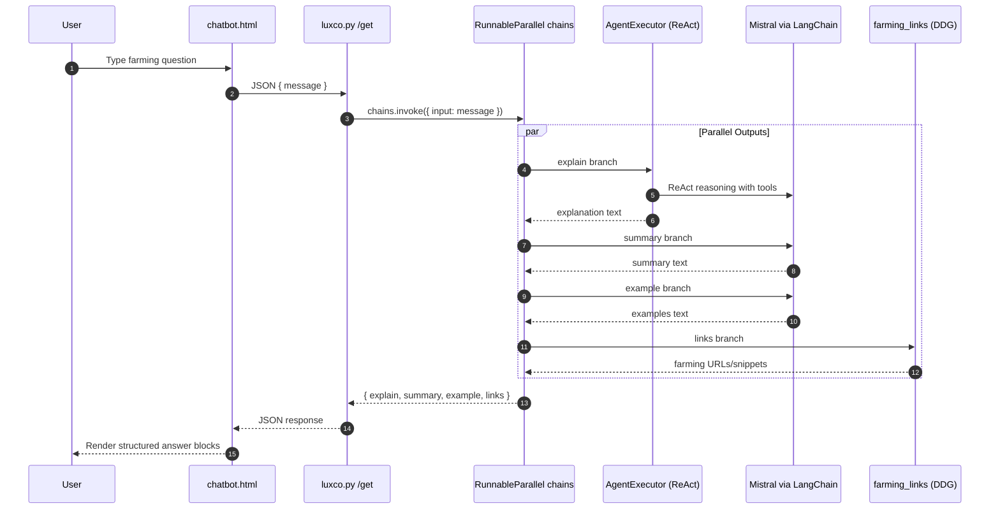
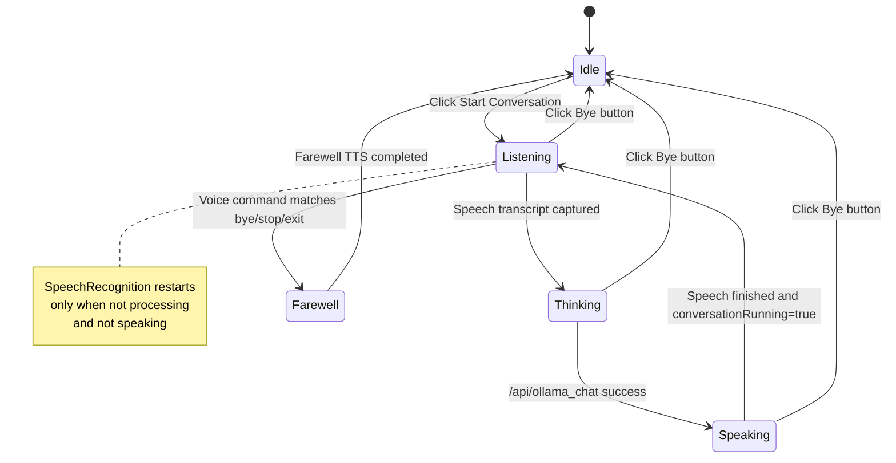
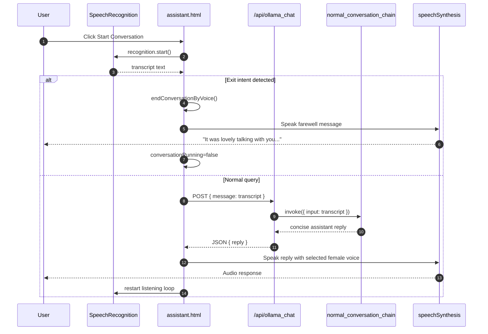

<p align="center">
  
  
  
  
  
  
</p>

<p align="center">
  <strong>Full-stack agriculture intelligence platform combining crop medicine prediction, RAG-augmented LLM guidance, multi-channel chat, and browser-based voice assistant.</strong>
</p>

---

## Table of Contents

1. [Project Overview](#project-overview)
2. [Luxco Product Modules (Y1 to Y5)](#luxco-product-modules-y1-to-y5)
3. [Technology Stack](#technology-stack)
4. [Skills and Concepts Used](#skills-and-concepts-used)
5. [Data Assets and Knowledge Base](#data-assets-and-knowledge-base)
6. [Repository Structure](#repository-structure)
7. [System Architecture](#system-architecture)
8. [End-to-End Platform Workflow](#end-to-end-platform-workflow)
9. [Machine Learning Prediction Workflow](#machine-learning-prediction-workflow)
10. [RAG Knowledge Retrieval Workflow](#rag-knowledge-retrieval-workflow)
11. [Text Chatbot Workflow (Luxco Y1)](#text-chatbot-workflow-luxco-y1)
12. [Voice Assistant Workflow (Speech)](#voice-assistant-workflow-speech)
13. [LangChain Orchestration Design](#langchain-orchestration-design)
14. [API and Route Reference](#api-and-route-reference)
15. [Frontend Pages](#frontend-pages)
16. [Research and Experiment Notebooks](#research-and-experiment-notebooks)
17. [Model Artifacts and Fine-Tuning Work](#model-artifacts-and-fine-tuning-work)
18. [Installation and Runtime Setup](#installation-and-runtime-setup)
19. [Operational Notes and Limitations](#operational-notes-and-limitations)
20. [Future Upgrade Directions](#future-upgrade-directions)
21. [License](#license)

---

## Project Overview

**Luxco Krushi AI** is a Flask-based agriculture platform designed as a portfolio-grade product, not a single-script demo. It connects deterministic machine learning, retrieval-augmented generation (RAG), local LLM inference through Ollama, and modern browser interfaces into one coherent system.

The platform serves farmers and learners through multiple interaction modes:

- **Structured crop advisory** via form-based medicine prediction
- **Text chat guidance** with multi-part AI responses
- **Hands-free voice conversation** with speech recognition and text-to-speech
- **Geographic agriculture exploration** through an interactive map
- **Content and engagement pages** for reels, sales, and machinery information

The main application entry point is `luxco.py`. All production routes, API endpoints, and template rendering are defined there.

---

## Luxco Product Modules (Y1 to Y5)

The landing page (`templates/index.html`) presents Luxco as a modular agriculture ecosystem:

| Module | Name | Route | Purpose |
|--------|------|-------|---------|
| Y1 | Text Chatbot | `/chatbot` | Multi-output AI guidance (explain, summary, examples, links) |
| Y2 | Crop Medicine Prediction | `/predict` | ML medicine recommendation + LLM expert suggestion |
| Y3 | Agriculture Map | `/#places` on index | Leaflet map with crop markers across Odisha, India, and global locations |
| Y4 | Sales Platform | `/sale` | Product and crop sales presentation page |
| Y5 | Farmer Guidance Reels | `/reel` | Video/reel-style guidance page |

Additional routes:

| Feature | Route | Purpose |
|---------|-------|---------|
| Voice Assistant | `/assistant` | Speech-driven Luxco conversation loop |
| Krushi Hub | `/krushi` | Dedicated agriculture section page |
| Machines | `/machines` | Machinery information page |
| Home | `/` | Main discovery and navigation hub |

---

## Technology Stack

<p>
  <a href="https://www.python.org/" target="_blank"></a>
  <a href="https://flask.palletsprojects.com/" target="_blank"></a>
  <a href="https://scikit-learn.org/" target="_blank"></a>
  <a href="https://www.langchain.com/" target="_blank"></a>
  <a href="https://ollama.com/" target="_blank"></a>
  <a href="https://github.com/facebookresearch/faiss" target="_blank"></a>
  <a href="https://leafletjs.com/" target="_blank"></a>
  <a href="https://developer.mozilla.org/en-US/docs/Web/API/Web_Speech_API" target="_blank"></a>
  <a href="https://pandas.pydata.org/" target="_blank"></a>
  <a href="https://jupyter.org/" target="_blank"></a>
  <a href="https://huggingface.co/docs/peft" target="_blank"></a>
</p>

| Layer | Technology | Role in this project |
|-------|------------|----------------------|
| Web server | Flask | Route handling, template rendering, JSON APIs |
| ML inference | scikit-learn (`DecisionTreeClassifier`, `OneHotEncoder`) | Crop medicine classification |
| LLM runtime | Ollama (`mistral`) via `ChatOllama` | Conversational and advisory text generation |
| Embeddings | Ollama (`nomic-embed-text`) via `OllamaEmbeddings` | Document vectorization for RAG |
| Vector store | FAISS (`langchain_community.vectorstores.FAISS`) | Persistent semantic retrieval index |
| Orchestration | LangChain (`PromptTemplate`, `RunnableParallel`, agents, tools) | Chain composition and tool routing |
| Web search tool | DuckDuckGo Search (`DDGS`) | Farming resource link discovery |
| Voice input | Browser `SpeechRecognition` / `webkitSpeechRecognition` | Speech-to-text in assistant page |
| Voice output | Browser `speechSynthesis` (`SpeechSynthesisUtterance`) | Text-to-speech playback |
| Map UI | Leaflet + OpenStreetMap tiles | Interactive agriculture location map |
| Frontend | HTML, CSS, JavaScript | All user-facing pages and client logic |

---

## Skills and Concepts Used

This project demonstrates practical implementation of the following concepts:

### Web Application Engineering
- Flask route design for page rendering and JSON APIs
- Server-side template injection for prediction results
- Client-side fetch-based asynchronous communication
- Multi-page product navigation and feature discovery UX

### Machine Learning Pipeline
- Tabular agriculture dataset loading with pandas
- Categorical feature encoding using `OneHotEncoder`
- Supervised classification with `DecisionTreeClassifier`
- Runtime inference function (`predict_medicine`) integrated into web POST flow

### Retrieval-Augmented Generation (RAG)
- Document chunk creation from agriculture CSV knowledge
- Embedding generation with Ollama embedding model
- FAISS index creation, persistence, and reload at runtime
- Retriever-based context injection into LLM prompts
- Context-constrained answering ("use ONLY provided context")

### LangChain Architecture Patterns
- Prompt templates for domain-specific tasks
- Output parsing with `StrOutputParser`
- Runnable composition (`prompt | model | parser`)
- Parallel execution with `RunnableParallel`
- ReAct agent setup via LangChain Hub prompt (`hwchase17/react`)
- Custom tools decorated with `@tool`

### Hybrid AI System Design
- Deterministic ML prediction combined with generative explanation
- Parallel multi-view chatbot response (explain + summary + examples + links)
- Dedicated lightweight conversation chain for voice latency optimization

### Speech Interface Engineering
- Continuous listen-think-speak loop with explicit state machine
- Voice exit intent detection (`bye`, `goodbye`, `stop`, etc.)
- Graceful loop termination with farewell speech response
- Female voice prioritization through browser voice selection heuristics

### MLOps and Experimentation Foundations
- Notebook-driven RAG index experimentation
- Separate index versions (`my_faiss_index`, `my_faiss_index_betterversion`)
- LoRA adapter artifacts stored under `tinyllama_agri/`
- Research notebooks for embedding behavior and fine-tuning workflow

---

## Data Assets and Knowledge Base

### 1) ML Training Dataset

**File:** `professional_crop_medicine_dataset_6000_rows.csv`

Used by `model.py` at application startup.

| Column | Usage |
|--------|-------|
| `Crop` | Input feature |
| `Problem` | Input feature |
| `Weather` | Input feature |
| `Soil_Type` | Input feature |
| `Growth_Stage` | Input feature |
| `Severity` | Input feature |
| `Recommended_Medicine` | Target label |

Training flow:
1. Load CSV into pandas DataFrame
2. One-hot encode six categorical input columns
3. Fit `DecisionTreeClassifier` on encoded features
4. Expose `predict_medicine(input_data)` for Flask route usage

### 2) Domain Knowledge CSV (Structured)

**File:** `crop_medicine_uses_dataset.csv`

Columns:
- `Crop_Medicine`
- `Uses_When_to_Use`

Contains practical usage guidance for crop protection products and agricultural inputs.

### 3) Domain Knowledge CSV (RAG Text Format)

**File:** `medicine_with_uses.csv`

Column:
- `fulltext`

Each row stores a sentence-style knowledge unit such as:
`"Neem Oil is used for ..."`

This file is used in RAG notebook pipelines to build FAISS document chunks.

### 4) Vector Indexes

| Index Directory | Status | Usage |
|-----------------|--------|-------|
| `my_faiss_index/` | Experimental baseline | Created in early RAG notebook workflow |
| `my_faiss_index_betterversion/` | Active runtime index | Loaded in `llm_chain.py` for `rag_predict()` |

Runtime retriever configuration in `llm_chain.py`:
- `search_kwargs={"k": 2}`

RAG prompt policy:
- Answer only from retrieved context
- If context is insufficient, return: `"I could not find relevant information."`

---

## Repository Structure

```text
again chatbot app for clearly flask/
|
|-- luxco.py                          # Main Flask app (routes + APIs)
|-- model.py                          # ML training + predict_medicine()
|-- llm_chain.py                      # LangChain chains, tools, RAG, agents
|-- stream_api.py                     # Optional streaming response utility
|
|-- professional_crop_medicine_dataset_6000_rows.csv
|-- crop_medicine_uses_dataset.csv
|-- medicine_with_uses.csv
|
|-- my_faiss_index/                   # FAISS index (initial)
|-- my_faiss_index_betterversion/     # FAISS index (active)
|
|-- templates/
|   |-- index.html                    # Landing + map + feature cards
|   |-- chatbot.html                  # Luxco Y1 text chatbot UI
|   |-- assistant.html                # Voice assistant UI + speech loop
|   |-- predict.html                  # Luxco Y2 prediction form/results
|   |-- krushi.html
|   |-- sale.html
|   |-- reel.html
|   |-- machines.html
|
|-- static/
|   |-- style.css                     # Shared chatbot styling
|   |-- normat-sate.png               # Assistant idle avatar image
|   |-- video_pr.mp4                  # Demo/promo video asset
|
|-- chatbot/                          # Base LLM config/tokenizer artifacts
|-- tinyllama_agri/                   # LoRA adapter artifacts (PEFT)
|
|-- RAG.ipynb
|-- embeddings Understanding(from_document).ipynb
|-- Fiine .ipynb
|-- finetuned modell.ipynb
|-- Bettershitfing by GPTMODEL.ipynb
|-- new_idea of creating rag chain & exporing new concept liraries direct deal with model etc.ipynb
|
|-- README.md
|-- luxco-banner.svg
```

---

## System Architecture



---

## End-to-End Platform Workflow



---

## Machine Learning Prediction Workflow



### ML Design Notes

- The model is trained in-process when `model.py` is imported (no separate model pickle file).
- Unknown category values are handled by encoder configuration: `handle_unknown='ignore'`.
- Prediction output is treated as structured signal, then enriched by RAG and LLM explanation layers.

---

## RAG Knowledge Retrieval Workflow



### RAG Prompt Contract

`rag_predict()` enforces a strict context-only answering policy:

1. Retrieve relevant documents from FAISS
2. Concatenate document text into `{context}`
3. Pass user query as `{question}`
4. Generate answer with local Mistral model
5. Refuse hallucination when context is missing

This design reduces unsupported agricultural claims and keeps generated advice tied to indexed knowledge.

---

## Text Chatbot Workflow (Luxco Y1)

Route: `/chatbot`  
API: `POST /get`



### Chatbot Response Structure

The chatbot UI intentionally returns four sections:

| Section | Chain Source | Purpose |
|---------|--------------|---------|
| Explanation | `agent_executor` | Deep reasoning and tool-assisted answer |
| Summary | `summary_chain` | Short digest of the topic |
| Examples | `example_chain` | Practical examples |
| Links | `farming_links` tool via DuckDuckGo | External farming resources |

This multi-view response format improves learning value and makes the assistant feel like a structured advisor rather than a single plain-text reply.

---

## Voice Assistant Workflow (Speech)

Route: `/assistant`  
API: `POST /api/ollama_chat`

The voice assistant is a browser-native speech interface built in `templates/assistant.html`. It does not use server-side audio processing; speech recognition and synthesis happen entirely in the client through Web Speech API capabilities.

### Voice Interaction States

| State | UI Indicator | Behavior |
|-------|--------------|----------|
| Idle | Static avatar | Waiting for Start Conversation |
| Listening | Glow ring + subtle avatar motion | Capturing user speech |
| Thinking | Status text: Thinking | Sending transcript to backend |
| Speaking | Speaking avatar (no bob animation) | TTS playback of model response |
| Ended | Idle avatar restored | Loop stopped by Bye button or voice command |

### Voice Loop State Machine



### Voice Assistant Sequence



### Voice UX Implementation Details

- **Speech input:** `SpeechRecognition` or `webkitSpeechRecognition`, language `en-US`
- **Speech output:** `SpeechSynthesisUtterance` with soft female voice preference
- **Voice selection priority:** Samantha, Aria, Zira, Hazel, then generic female voices
- **TTS tuning:** `rate = 0.95`, `pitch = 1.55` for clearer and warmer delivery
- **Loop guard:** `processing` lock prevents overlapping recognition during model calls
- **Timeout protection:** fetch abort controller at 15 seconds
- **Exit commands:** `bye`, `goodbye`, `bye bye`, `stop`, `end conversation`, `stop conversation`, `exit`

### Voice Backend Chain

Voice route uses `normal_conversation_chain` (not the heavy parallel `/get` chain) to reduce latency and produce short, speech-friendly answers.

Prompt behavior in `llm_chain.py`:
- Answer the exact user question directly
- Avoid repetitive intro text
- Keep responses practical and concise

---

## LangChain Orchestration Design

`llm_chain.py` is the core intelligence module.

### Model Configuration

```python
model = ChatOllama(model="mistral", temperature=0.2)
```

Lower temperature improves consistency for agricultural advisory use cases.

### Defined Chains

| Chain | Template / Composition | Used By |
|-------|------------------------|---------|
| `explain_chain` | `explain_prompt | model | parser` | Internal / parallel design |
| `summary_chain` | `summary_prompt | model | parser` | `/get` |
| `example_chain` | `example_prompt | model | parser` | `/get` |
| `predict_chain` | `predict_prompt | model | parser` | `/predict` |
| `tool_chain` | `tool_prompt | model | parser` | Tool-aware prompt pattern |
| `normal_conversation_chain` | `normal_conversation_prompt | model | parser` | `/api/ollama_chat` |
| `chains` | `RunnableParallel(...)` | `/get` |

### Parallel Chain Composition

```python
chains = RunnableParallel(
    explain=agent_executor,
    summary=summary_chain,
    example=example_chain,
    links=RunnableLambda(lambda x: farming_links.invoke(x["input"]))
)
```

### Tools and Agent

Tools declared in `llm_chain.py`:

| Tool | Function |
|------|----------|
| `rag_answer` | Retrieve FAISS documents for a query |
| `read_file` | Read local file contents |
| `save_notes` | Save notes to local file |
| `current_time` | Return current timestamp |
| `farming_links` | Query DuckDuckGo for farming resources |

ReAct agent setup:
- Prompt pulled from LangChain Hub: `hwchase17/react`
- Agent executor verbose mode enabled
- Agent used in explain branch of parallel chatbot chain

---

## API and Route Reference

| Route | Method | Input | Output | Description |
|-------|--------|-------|--------|-------------|
| `/` | GET | None | HTML | Landing page with map and feature cards |
| `/krushi` | GET | None | HTML | Krushi section page |
| `/sale` | GET | None | HTML | Sales page |
| `/machines` | GET | None | HTML | Machines page |
| `/chatbot` | GET | None | HTML | Text chatbot UI |
| `/assistant` | GET | None | HTML | Voice assistant UI |
| `/predict` | GET | None | HTML | Prediction form page |
| `/predict` | POST | Form fields: crop, problem, weather, soil, stage, severity | HTML | ML + RAG + LLM advisory pipeline |
| `/reel` | GET | None | HTML | Reel/video page |
| `/get` | POST | JSON `{ "message": "..." }` | JSON `{ "reply": { explain, summary, example, links } }` | Multi-output chatbot API |
| `/api/ollama_chat` | POST | JSON `{ "message": "..." }` | JSON `{ "reply": "...", "status": "success" }` | Voice assistant API |

### Error Handling (/api/ollama_chat)

- Empty message returns HTTP 400 with fallback reply
- Model invocation exceptions return user-safe fallback text
- Unexpected server exceptions return HTTP 500 with error metadata

---

## Frontend Pages

### index.html
- Modern dark-green agriculture landing design
- Hero section with embedded video
- Feature cards for Luxco Y1 to Y5
- Voice assistant entry button (`/assistant`)
- Leaflet map with extensive crop location markers

### chatbot.html
- Uses shared stylesheet `static/style.css`
- Single input chat interface
- Structured response rendering blocks

### assistant.html
- Voice-first interface with centered avatar GIF container
- Start Conversation and Bye controls
- Status line and assistant reply panel
- Speech loop logic implemented in page script

### predict.html
- Form-driven crop context collection
- Displays predicted medicine and LLM suggestion after POST
- Styled consistently with chatbot visual language

---

## Research and Experiment Notebooks

The repository includes notebooks used to design and validate AI components:

| Notebook | Focus |
|----------|-------|
| `RAG.ipynb` | Build FAISS vector store from agriculture documents |
| `embeddings Understanding(from_document).ipynb` | Embedding behavior, metadata vs page content analysis |
| `Fiine .ipynb` | LoRA configuration and adapter application concepts |
| `finetuned modell.ipynb` | Model fine-tuning experiments |
| `Bettershitfing by GPTMODEL.ipynb` | RAG/index experimentation with Ollama embeddings |
| `new_idea of creating rag chain & exporing new concept liraries direct deal with model etc.ipynb` | Chain design exploration |

These notebooks represent the research layer that informed production decisions in `llm_chain.py`.

---

## Model Artifacts and Fine-Tuning Work

### Base Chatbot Artifacts (`chatbot/`)

Contains model/tokenizer configuration files for a Llama-style causal language model (`LlamaForCausalLM` architecture in `config.json`).

### LoRA Adapter (`tinyllama_agri/`)

Contains PEFT LoRA adapter artifacts (`adapter_config.json`, tokenizer configs, training args).  
This indicates experimentation with parameter-efficient fine-tuning for agriculture-domain response behavior.

Current production runtime for web routes uses Ollama Mistral through LangChain, while fine-tuned local artifacts remain available for future integration.

---

## Installation and Runtime Setup

### Prerequisites

1. Python 3.10+ recommended
2. Ollama installed and running locally
3. Required Ollama models pulled:

```bash
ollama pull mistral
ollama pull nomic-embed-text
```

### Python Dependencies

Install core packages used by the app modules:

```bash
pip install flask pandas scikit-learn duckduckgo-search langchain-ollama langchain-core langchain-community langchain-classic faiss-cpu
```

Additional environment packages may be required depending on your LangChain version and local setup.

### Run Application

```bash
python luxco.py
```

Open:

```text
http://127.0.0.1:5000
```

Voice assistant page:

```text
http://127.0.0.1:5000/assistant
```

### Recommended Browser for Voice Assistant

Use a Chromium-based browser or Edge for best Web Speech API support.  
Speech recognition availability depends on browser and OS speech capabilities.

---

## Operational Notes and Limitations

1. **Model boot cost:** `model.py` trains the decision tree at import time; first startup can take longer on large datasets.
2. **Local LLM dependency:** If Ollama is not running, LangChain model calls fail and fallback messages are returned.
3. **RAG quality depends on index coverage:** Unknown topics outside FAISS knowledge may produce context-missing responses.
4. **Voice recognition accuracy varies:** Background noise and microphone quality affect transcript quality.
5. **Browser voice differences:** Available TTS voices depend on OS/browser installed voices.
6. **Parallel chatbot latency:** `/get` runs multiple branches (agent + chains + search), so response time is higher than voice route.
7. **Streaming utility not mounted:** `stream_api.py` exists but is not currently wired as an active Flask route in `luxco.py`.

---

## Future Upgrade Directions

- Persist trained ML model and encoder with versioned artifacts (`.pkl` or ONNX)
- Add confidence score and feature importance explanation for predictions
- Integrate fine-tuned local adapter (`tinyllama_agri`) into runtime inference path
- Add conversation memory for voice and text assistants
- Enable true token streaming endpoint for chatbot response sections
- Add multilingual support (Odia/Hindi/English) for farmer accessibility
- Connect live weather/soil APIs for context-aware recommendations
- Add authentication, session history, and advisory audit logs

---

## Demo Media

<p align="center">
  <video src="static/video_pr.mp4" controls width="800"></video>
</p>

---

## Contribution Direction

Contributions are welcome in:

- ML evaluation and model persistence workflow
- RAG index quality and metadata enrichment
- Prompt engineering for domain safety and clarity
- Voice UX reliability across browsers
- API validation, logging, and modular architecture

---

## License

This project is intended for educational, portfolio, and demonstration use.
